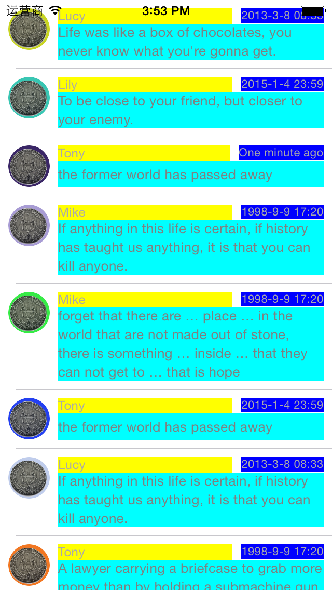
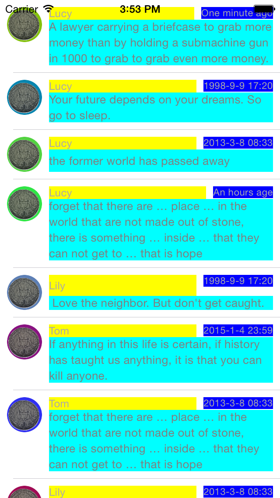

# CellSelfSizing

The iOS 7 &amp; iOS 8 dynamic cell height demo &amp; selfsizing

Ony One Suggestion: **Make sure all your constraints are correct.**

iOS 7:

 
 
iOS 8:

## Why ?

I have read so many blog about selfsizing.

But no one is really make me satisfied

Such as 「[raywenderlich's tutorial](http://www.raywenderlich.com/73602/dynamic-table-view-cell-height-auto-layout)」 also hava some issues.

So I decide to write my own demo.

At last. I found the key point is 

`make sure all your constaints are correct`

otherwise, you will get some strange result.

This demo hava two version of IB and [Masonry](https://github.com/SnapKit/Masonry).

Send issues is always welcome！

## Requirement

- iOS7+
- Xcode6+

## LICENSE

- This demo is available under the MIT license. See the LICENSE file for more info